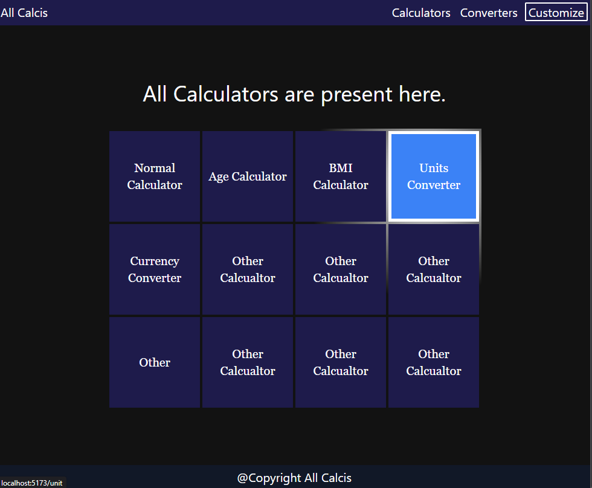
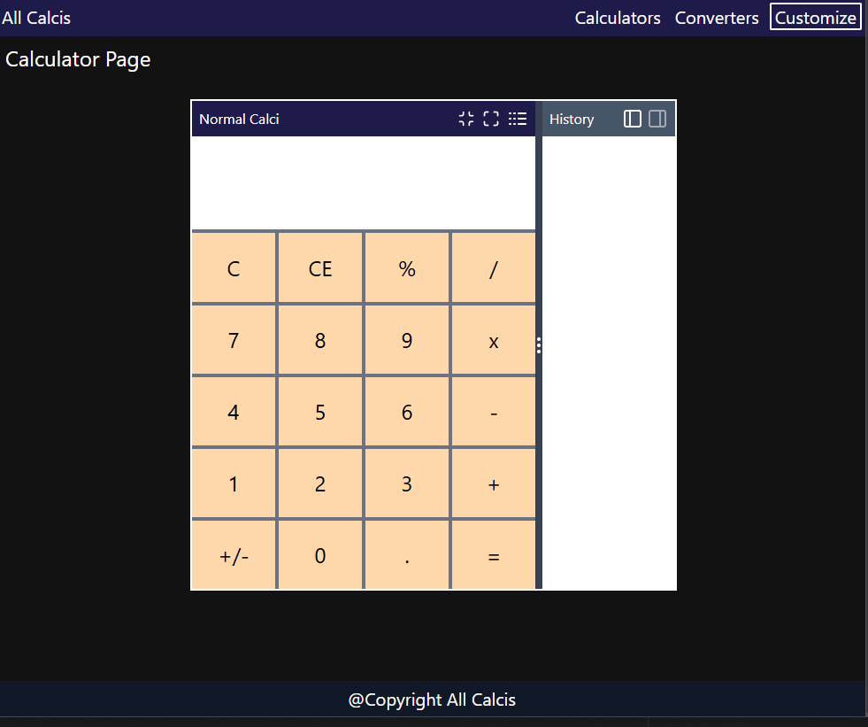
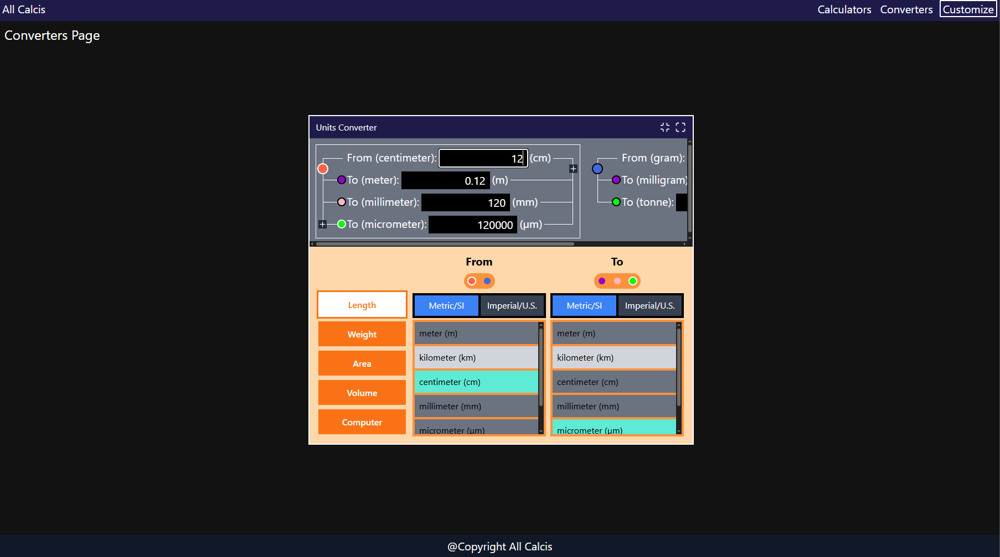
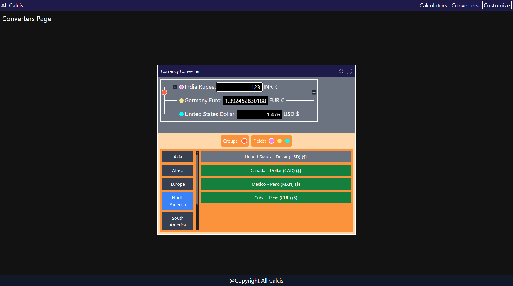

# All Calcis
A site that provides advance calculators and converters.

### Technology Used
1. React
2. React Router
3. Lucide Icons
4. TypeScript
5. Tailwind CSS

## Features
1. Window like UI 
2. Maximize/Minimize and Move the window
3. Multiple input fields that you can dynamically add

## Getting Started
### Prerequisites
Make sure you have Node.js installed on your system.

### Installation and Running
1. Clone the repository to your local machine.
2. Navigate to the project folder.
3. Install dependencies with npm install or yarn install.
4. Start the development server with npm run dev or yarn dev.
5. Open your browser and go to http://localhost:5173 (or the port shown in the terminal) to use the app.
### Building for Production
1. Run npm run build or yarn build to create an optimized production build.
2. You can preview the production build locally using npm run preview or yarn preview.
